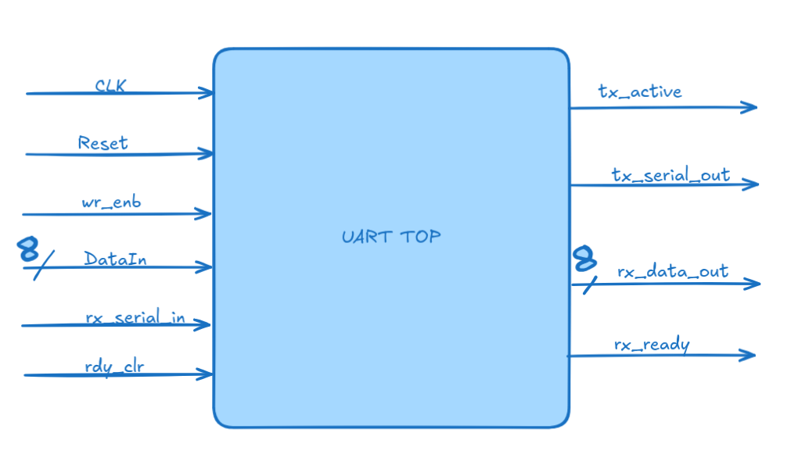
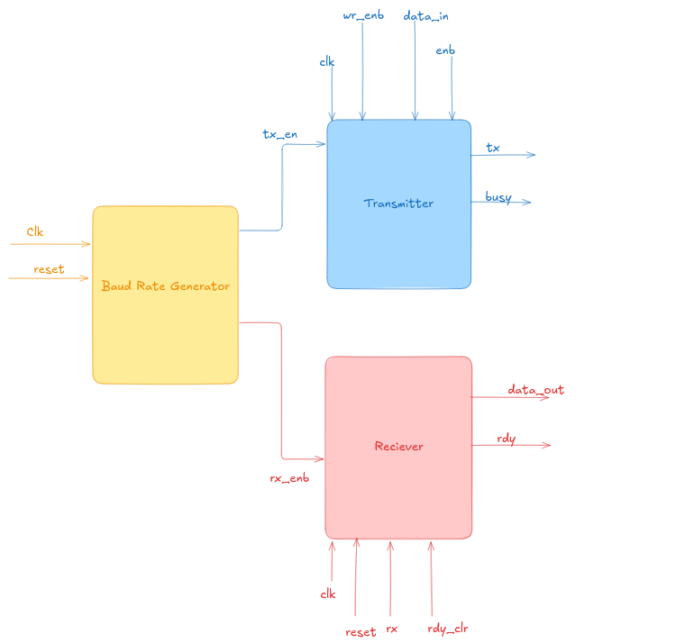

# UART Communication System

A full-duplex UART (Universal Asynchronous Receiver/Transmitter) protocol implementation in Verilog featuring configurable baud rate generation and FSM-based data transmission.

## Overview

This project implements a complete UART communication system with separate transmitter and receiver modules, designed for serial data communication between digital devices. The design uses finite state machines (FSM) for robust protocol handling and includes a configurable baud rate generator.

## Features

- **Full-duplex communication**: Simultaneous transmission and reception
- **FSM-based architecture**: Separate state machines for TX and RX modules
- **Configurable baud rate**: Adjustable through BaudRateGenerator module
- **16x oversampling**: Enhanced reliability in the receiver for accurate data sampling
- **8-bit data frame**: Standard UART data width with start/stop bits
- **Handshake mechanism**: Ready-clear signal for data acknowledgment
- **Clock domain handling**: Independent enable signals for TX and RX

## Module Description

### 1. `uart_top`
Top-level module that instantiates and connects all submodules.


**Ports:**
- `clk`: System clock input
- `reset`: Asynchronous reset
- `wr_enb`: Write enable for transmission
- `data_in[7:0]`: 8-bit data to transmit
- `tx_serial_out`: Serial transmit output
- `rx_serial_in`: Serial receive input
- `rx_data_out[7:0]`: Received 8-bit data
- `tx_active`: Transmitter busy flag
- `rx_ready`: Data ready flag
- `rdy_clr`: Ready clear acknowledgment



### 2. `transmitter`
Handles serial data transmission using a 4-state FSM.

**States:**
- `idle_state`: Waits for write enable
- `start_state`: Sends start bit (logic 0)
- `data_state`: Transmits 8 data bits (LSB first)
- `stop_state`: Sends stop bit (logic 1)

### 3. `receiver`
Handles serial data reception with 16x oversampling.

**States:**
- `start_state`: Detects start bit
- `data_out_state`: Samples 8 data bits at midpoint
- `stop_state`: Validates stop bit and outputs data

### 4. `BaudRateGenerator`
Generates enable pulses for TX and RX modules.

**Configuration:**
- TX baud rate: Clock cycles = 5207 (9600 baud @ 50MHz)
- RX sampling rate: Clock cycles = 324 (16x oversampling)

## Timing Specifications

**Baud Rate Calculation:**

For 50 MHz system clock:
- TX Baud Rate ≈ 9600 bps
- RX Sampling Rate ≈ 153.8 kHz (16x oversampling)

tx_counter = (System_Clock / Desired_Baud_Rate) - 1
rx_counter = (System_Clock / (Desired_Baud_Rate × 16)) - 1

Therefore the values would be
#### Counter Values
- **TX Counter**: 5207 cycles
- **RX Counter**: 324 cycles


## Usage

### Simulation

1. **Compile the design:**
```bash
iverilog -o uart_sim uart_top.v transmitter.v receiver.v BaudRateGenerator.v
```
2. **Waveform Simulation:**
```bash
gtkwave uart_simulation.vcd
```

